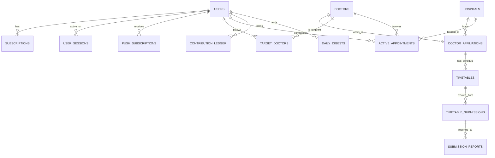

# Janet Sales Calendar - Database Schema (Plan A)

本文件定義針對 [PRD_planA.md](./PRD_planA.md) 規格所設計的 Supabase (PostgreSQL) 資料庫架構。

## 核心設計理念
1. **多租戶隔離 (Multi-tenant Data Isolation)**：系統為 B2B/SaaS 性質，利用 Supabase Row Level Security (RLS) 確保每位業務員 (`user_id`) 只能存取自己的客戶名單、筆記與行程。
2. **共用資源開放 (Shared Resources)**：醫院清單、科別清單、醫師基本資料與「門診表時間`timetables`」屬於全域共用資料，所有已登入且處於訂閱狀態的會員皆可 `SELECT`。
3. **時間精確度 (Time Granularity)**：為了與 Google Calendar 完美雙向同步，資料庫中的所有排程時間皆以精確的 `TIMESTAMP WITH TIME ZONE` (timestamptz) 儲存，不使用模糊的「上午/下午」字串。

---

## 實體關聯圖 (ERD)

---

## 資料表結構 (Table Schemas)

### 1. `users` (使用者與權限)
延伸 Supabase Auth 的 `auth.users`，儲存應用程式等級的使用者設定與金流綁定狀態。

| 欄位名稱 (Column) | 型別 (Type) | 屬性 (Attributes) | 說明 (Description) |
| :--- | :--- | :--- | :--- |
| `id` | uuid | PK, FK(`auth.users.id`) | 使用者唯一識別碼 |
| `email` | varchar | UNIQUE, NOT NULL | 登入與金流綁定的 Email |
| `full_name` | varchar | | 使用者顯示名稱 |
| `is_onboarded` | boolean | DEFAULT false | 是否已完成初次引導流程 |
| `gcal_access_token` | varchar | | 業務授權的 Google Calendar Token (可加密) |
| `gcal_refresh_token`| varchar | | Google Calendar Refresh Token |
| `gcal_calendar_id` | varchar | | `Janet Sales Calendar` 專屬子日曆的 ID |
| `created_at` | timestamptz | DEFAULT now() | 帳號建立時間 |

**RLS Policy**:
- 讀取/更新：僅限 `auth.uid() = id`。

### 2. `hospitals` (醫院字典表 - 共用)
全站共用的醫院主檔。此表預期由官方建立或透過 UGC 審核後上線。

| 欄位名稱 (Column) | 型別 (Type) | 屬性 (Attributes) | 說明 (Description) |
| :--- | :--- | :--- | :--- |
| `id` | uuid | PK, DEFAULT uuid_generate_v4() | 醫院唯一識別碼 |
| `name` | varchar | NOT NULL | 醫院名稱 (例如：台北榮民總醫院) |
| `region` | varchar | | 行政區或縣市 (例如：台北市北投區) |
| `address` | varchar | | 詳細地址 |
| `created_at` | timestamptz | DEFAULT now() | |

**RLS Policy**:
- 讀取：所有已授權使用者 (`authenticated` role)。
- 寫入：僅限 `admin` 權限。

### 3. `doctors` (醫師字典表 - 共用)
全站共用的醫師主檔。抽離原本綁定單一醫院的限制，僅保留醫師本人的基礎資訊。

| 欄位名稱 (Column) | 型別 (Type) | 屬性 (Attributes) | 說明 (Description) |
| :--- | :--- | :--- | :--- |
| `id` | uuid | PK, DEFAULT uuid_generate_v4() | 醫師唯一識別碼 |
| `name` | varchar | NOT NULL | 醫師姓名 |
| `specialty` | varchar | | 專科或主治項目 (例如：心臟內科) |
| `search_vector` | tsvector | | 全文檢索引擎欄位 (支援模糊比對) |
| `created_at` | timestamptz | DEFAULT now() | |

**RLS Policy**:
- 讀取：所有已授權使用者。
- 寫入：僅限 `admin` 權限。

### 3.5 `doctor_affiliations` (醫師跨院看診關聯表 - 共用)
處理「一位醫師同時在多家醫院看診」的多對多 (N:M) 橋接表。

| 欄位名稱 (Column) | 型別 (Type) | 屬性 (Attributes) | 說明 (Description) |
| :--- | :--- | :--- | :--- |
| `id` | uuid | PK, DEFAULT uuid_generate_v4() | 關聯唯一識別碼 |
| `doctor_id` | uuid | FK(`doctors.id`), NOT NULL | 對應醫師 |
| `hospital_id` | uuid | FK(`hospitals.id`), NOT NULL | 該醫師看診的醫院 |
| `department` | varchar | NOT NULL | 該醫師在此醫院的科別編制 |
| `created_at` | timestamptz | DEFAULT now() | |

**RLS Policy**:
- 讀取：所有已授權使用者。
- 寫入：僅限 `admin` 權限。

### 4. `timetables` (門診時間表 - 共用核心)
儲存經過 OCR 解析並經後台確認的「精確」醫師看診時段。前端以此表繪出排程畫面。

| 欄位名稱 (Column) | 型別 (Type) | 屬性 (Attributes) | 說明 (Description) |
| :--- | :--- | :--- | :--- |
| `id` | uuid | PK, DEFAULT uuid_generate_v4() | 門診紀錄唯一識別碼 |
| `affiliation_id` | uuid | FK(`doctor_affiliations.id`), NOT NULL | 直接關聯至特定的「醫師-醫院」組合 |
| `day_of_week` | smallint | NOT NULL | 星期幾 (1=週一, 7=週日) |
| `session_type` | enum | NOT NULL | 時段分期 (`morning`, `afternoon`, `night`) |
| `start_time` | time | NOT NULL | 該院該診精確開始時間 (例 08:30:00) |
| `end_time` | time | NOT NULL | 該院該診精確結束時間 (例 12:00:00) |
| `valid_from` | date | NOT NULL | 此門診表生效日期 |
| `valid_until` | date | | 失效日期 (若有新表覆寫) |
| `status` | enum | DEFAULT 'active' | 狀態 (`active`, `suspended_temp`, `archived`) |
| `last_verified_at`| timestamptz | | 前台顯示的「最後更新時間」 |

**RLS Policy**:
- 讀取：所有已授權使用者。
- 寫入：僅限 `admin` 權限。

### 5. `target_doctors` (我的關注與 Zero-Entry 筆記 - 絕對隔離)
每個業務員自己的「口袋名單」與私密筆記。此表為 Zero-Entry 系統的基石。

| 欄位名稱 (Column) | 型別 (Type) | 屬性 (Attributes) | 說明 (Description) |
| :--- | :--- | :--- | :--- |
| `id` | uuid | PK, DEFAULT uuid_generate_v4() | 關聯唯一識別碼 |
| `user_id` | uuid | FK(`users.id`), NOT NULL | 建立該關注名單的業務員 |
| `doctor_id` | uuid | FK(`doctors.id`), NOT NULL | 關注的醫師 |
| `private_notes` | text | | 自由文字方塊 (例如：喜歡喝50嵐) |
| `created_at` | timestamptz | DEFAULT now() | 加入關注的時間 |
| `updated_at` | timestamptz | DEFAULT now() | 筆記最後修改時間 |

*(註：`last_visited_date` 與 `next_visit_date` 依 PRD 精神不實體存入此表，而是從 `active_appointments` 動態算出，以實現真正的 Zero-Entry)*

**RLS Policy**:
- 讀取/寫入/刪除：僅限 `auth.uid() = user_id`。

### 6. `active_appointments` (雙向同步行程表 - 絕對隔離)
使用者排定的拜訪行程，作為與 Google Calendar 雙向同步的 Bridge 表。若在 Google 刪除「過去」的行程，在此表會被標記為 `is_historical=true` 而不被刪除。

| 欄位名稱 (Column) | 型別 (Type) | 屬性 (Attributes) | 說明 (Description) |
| :--- | :--- | :--- | :--- |
| `id` | uuid | PK, DEFAULT uuid_generate_v4() | 行程唯一識別碼 |
| `user_id` | uuid | FK(`users.id`), NOT NULL | 建立該行程的業務員 |
| `doctor_id` | uuid | FK(`doctors.id`), NOT NULL | 準備拜訪的醫師 |
| `hospital_id` | uuid | FK(`hospitals.id`), NOT NULL | 準備拜訪的醫院 (醫師跨院，需明確指定拜訪地點) |
| `gcal_event_id` | varchar | | 對應到 Google Calendar 的 Event ID |
| `start_time` | timestamptz | NOT NULL | 拜訪開始時間 |
| `end_time` | timestamptz | NOT NULL | 拜訪結束時間 |
| `notes` | text | | 單次拜訪的備註 |
| `sync_status` | enum | DEFAULT 'pending' | 同步狀態 (`pending`, `synced`, `failed`) |
| `is_historical` | boolean | DEFAULT false | 若為 true，代表是保護不被雙向刪除的過去紀錄 |

**RLS Policy**:
- 讀取/寫入/刪除：僅限 `auth.uid() = user_id`。

### 7. `timetable_submissions` (UGC 門診表上傳)
供業務端上傳，或後台直接上傳之 PDF/圖檔佇列。作為 OCR 解析引擎的任務 Queue。

| 欄位名稱 (Column) | 型別 (Type) | 屬性 (Attributes) | 說明 (Description) |
| :--- | :--- | :--- | :--- |
| `id` | uuid | PK, DEFAULT uuid_generate_v4() | 上傳任務唯一識別碼 |
| `uploader_id` | uuid | FK(`users.id`), NOT NULL | 貢獻者/上傳者 |
| `hospital_id` | uuid | FK(`hospitals.id`), NOT NULL | 對應的醫院 (使用者上傳時指定) |
| `target_month` | varchar | NOT NULL | 目標月份 (例如 `2024-06`) |
| `source_type` | enum | NOT NULL | 來源類型 (`pdf`, `image`, `url`) |
| `file_url` | varchar | | 存在 Supabase Storage 的 PDF/圖檔位址 或外部網址 |
| `file_hash` | varchar | | 檔案的 MD5/SHA256 雜湊值 (防止重複上傳) |
| `processing_status`| enum | DEFAULT 'pending' | 處理狀態 (`pending`, `ocr_success`, `needs_admin`, `rejected`, `approved`) |
| `admin_feedback`| text | | 退件或處理理由 |
| `created_at` | timestamptz | DEFAULT now() | 上傳時間 (用於計算折抵月費貢獻度) |

**Constraints**:
- `UNIQUE(hospital_id, target_month, file_hash)`: 防止同一人在當月重複上傳相同檔案。

**RLS Policy**:
- 讀取：僅能讀取 `uploader_id = auth.uid()` 之任務狀態。
- 寫入：使用者可 Insert，但僅 `admin` 能 Update 狀態。

### 8. `subscriptions` (訂閱與金流狀態)
管理與 Stripe/藍新等金流服務對接的訂閱週期。

| 欄位名稱 (Column) | 型別 (Type) | 屬性 (Attributes) | 說明 (Description) |
| :--- | :--- | :--- | :--- |
| `id` | uuid | PK, DEFAULT uuid_generate_v4() | 訂閱紀錄唯一識別碼 |
| `user_id` | uuid | FK(`users.id`), NOT NULL | 關聯使用者 |
| `stripe_customer_id`| varchar | | 金流平台客戶 ID |
| `stripe_sub_id` | varchar | | 金流平台訂閱 ID |
| `status` | enum | DEFAULT 'free_trial' | 訂閱狀態 (`free_trial`, `active`, `past_due`, `canceled`) |
| `current_period_end`| timestamptz | | 當期訂閱/試用結束時間 |
| `updated_at` | timestamptz | DEFAULT now() | |

### 9. `user_sessions` (裝置登入限制)
防範多人共用帳號，限制單一帳號的最大同時登入裝置數。

| 欄位名稱 (Column) | 型別 (Type) | 屬性 (Attributes) | 說明 (Description) |
| :--- | :--- | :--- | :--- |
| `id` | uuid | PK, DEFAULT uuid_generate_v4() | Session 識別碼 |
| `user_id` | uuid | FK(`users.id`), NOT NULL | |
| `device_info` | varchar | | User-Agent 或裝置辨識碼 |
| `last_active_at`| timestamptz | DEFAULT now() | |

### 10. `push_subscriptions` (Web Push 訂閱)
儲存 PWA 的 Web Push Token，用於傳送 Daily Digest 等系統推播。

| 欄位名稱 (Column) | 型別 (Type) | 屬性 (Attributes) | 說明 (Description) |
| :--- | :--- | :--- | :--- |
| `id` | uuid | PK, DEFAULT uuid_generate_v4() | |
| `user_id` | uuid | FK(`users.id`), NOT NULL | |
| `push_token` | varchar | NOT NULL | FCM 或 Web Push Token |
| `platform` | varchar | | `ios_safari`, `android_chrome` 等 |

### 11. `submission_reports` (UGC 檢舉防弊)
讓使用者檢舉錯誤的門診表上傳，進入管理員覆核流程。

| 欄位名稱 (Column) | 型別 (Type) | 屬性 (Attributes) | 說明 (Description) |
| :--- | :--- | :--- | :--- |
| `id` | uuid | PK, DEFAULT uuid_generate_v4() | |
| `submission_id` | uuid | FK(`timetable_submissions.id`), NOT NULL | 被檢舉的上傳任務 |
| `reporter_id` | uuid | FK(`users.id`), NOT NULL | 檢舉人 |
| `reason` | text | NOT NULL | 檢舉理由 |
| `status` | enum | DEFAULT 'pending'| 審核狀態 (`pending`, `validated`, `dismissed`) |

### 12. `contribution_ledger` (貢獻度帳本)
記錄使用者因上傳有效門診表而獲得的積分/次月折抵額度。

| 欄位名稱 (Column) | 型別 (Type) | 屬性 (Attributes) | 說明 (Description) |
| :--- | :--- | :--- | :--- |
| `id` | uuid | PK, DEFAULT uuid_generate_v4() | |
| `user_id` | uuid | FK(`users.id`), NOT NULL | |
| `submission_id` | uuid | FK(`timetable_submissions.id`) | 關聯之有效任務 |
| `points_earned` | integer | NOT NULL | 獲得點數 |
| `target_month` | varchar | NOT NULL | 折抵適用的月份 |
| `created_at` | timestamptz | DEFAULT now() | |

### 13. `daily_digests` (每日異動總覽紀錄)
供業務端於 PWA 拉取過去產生的門診表異動與回訪提醒。

| 欄位名稱 (Column) | 型別 (Type) | 屬性 (Attributes) | 說明 (Description) |
| :--- | :--- | :--- | :--- |
| `id` | uuid | PK, DEFAULT uuid_generate_v4() | |
| `user_id` | uuid | FK(`users.id`), NOT NULL | |
| `related_doctor_id` | uuid | FK(`doctors.id`) | (選填) 異動或提醒涉及的醫師 |
| `summary` | text | NOT NULL | 異動總覽文字 (例如：台大醫院林OO醫師新增2個時段) |
| `type` | enum | NOT NULL | 種類 (`timetable_changed`, `visit_reminder`, `system`) |
| `is_read` | boolean | DEFAULT false | 使用者是否已讀 |
| `created_at` | timestamptz | DEFAULT now() | 推播產生時間 |
